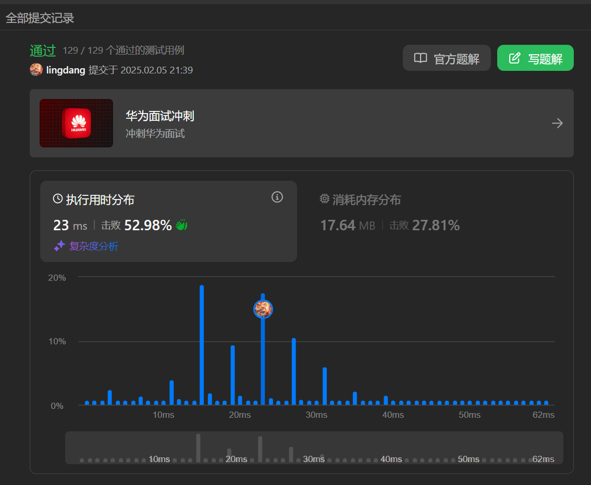
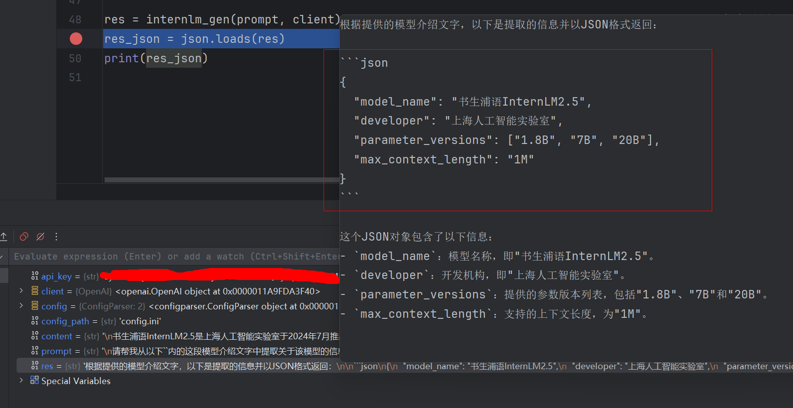
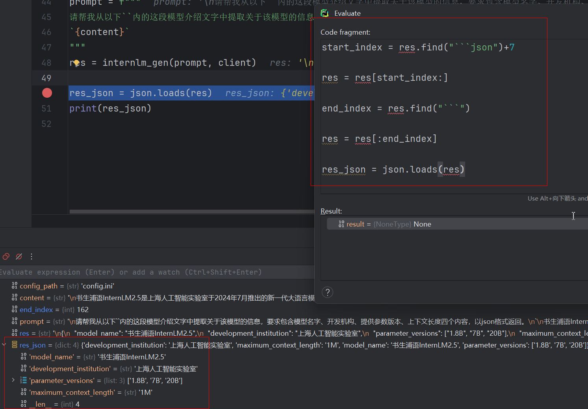

### 打卡
#### task1 


代码
```python
class Solution:
    def canConstruct(self, ransomNote: str, magazine: str) -> bool:
        m_list = list(magazine)
        for item in ransomNote:
            if item in m_list:
                m_list.remove(item)
            else:
                return False
        return True
```

### task02 没有用server上python。 用的本地的。（每次重启都要配置太麻烦了）

`step1`

看到 `res` 里面很多不可json化的东西，关键信息只有 这个json 里面这段文本。所以做一个字符分割:

debug 完成。解决bug。
